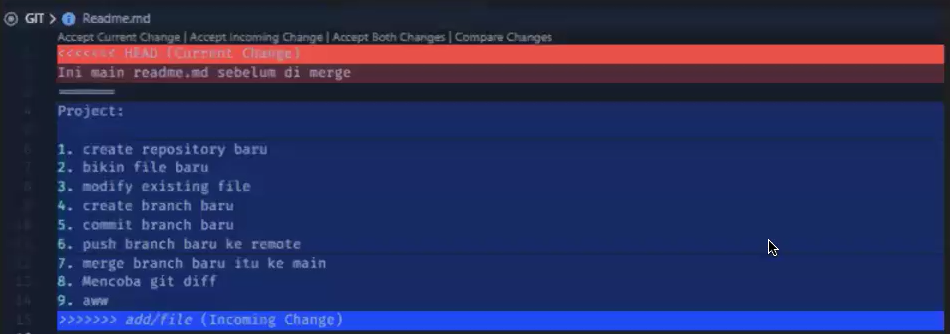
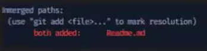

1. Make directory
2. masuk ke dir baru
3. git init
4. git config user.name isikan username GitHub
5. git config user.mail isikan email GitHub
6. git chekout -b main

Project:
1. create repository baru
2. bikin file baru
3. modify existing file
4. create branch baru: ' git checkout -b add/file'
5. new file ke staging: 'git add .' atau 'git add nama_file1 nama_file2'
6. commit branch baru: 'git commit -m "adding readme file"'
7. lihat log: 'git log -n2' '-n' untuk mendefinisikan banyak log commit id yang mau dilihat
8. Menyimpan perubahan ke stash sementara karena masih WIP (Work In Progress): 'git stash'
9. Pindah branch dari add/file ke main:
    'git checkout -b main' (branch main baru)
    'git checkout main' (untuk yang udah ada branch main-nya)
10. Kembalikan stash yang WIP : 'git stash pop'
11. tambahkan beberapa line di test.txt
12. 'git add test.txt'
13. commit perubahan di test.txt: 'git commit -m "menambahkan beberapa lines"
14. melihat perubahan line di testfile Readme.md: 'git diff Readme.md'
15. add Readme.md ke staging: 'git add Readme.md'
16. Commit perubahan di Readme.md
17. melihat log lebih simple
18. push branch baru ke remote
19. create Repository du GitHub
20. copy url Repository di GitHub
21. check remote listnya: 'git remote -v'
22. add remote to local repository: 'git remote add origin <remote-url>
23. pastikan remotenya udah ada: 'git remote -v'
24. git push ke remote: 'git push origin add/file'
25. create pull request 
26. merge branch baru itu ke main

# Resolve Conflict:
1. Kalau terjadi conflict seperti gambar di bawah ini

2. yang perlu kita lakukan:
    - diskusikan dengan tema mana yang benar
    - apakah accpet both changes, incoming changes, current changes
    - klik salah satu antara ketiga pilihan itu
    - save file
    - 'git status': untuk melihat status git repository

    - 'git add Readme.md'
    - 'git commit -m "message"
    - 'git push origin nama-branch'